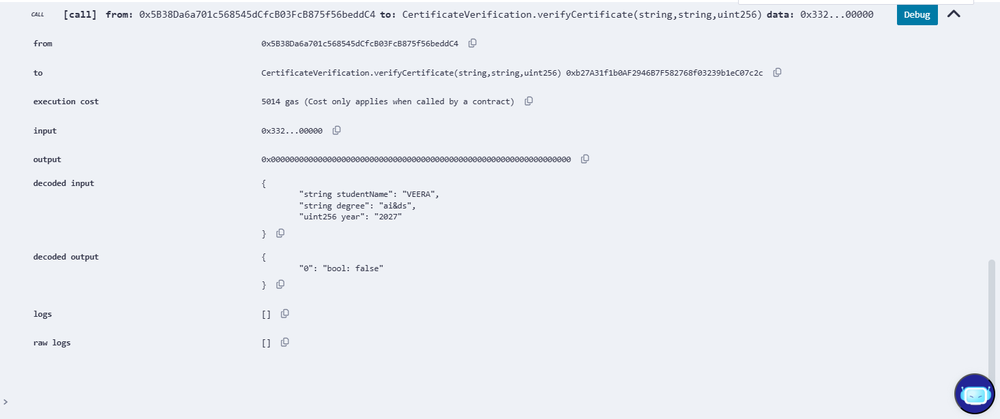

### Experiment 1: Decentralized Certificate Verification

# NAME:MOHAMED AAKIF ASRAR S
# REGISTER NO:212223240088
# DATE : 16/04/2025

## Aim:
  To develop a smart contract for issuing and verifying academic certificates on Ethereum, preventing forgery and ensuring authenticity.
## Algorithm:
# Step-1: 
Issuer Creates Certificate: Generate and digitally sign the certificate.

# Step-2: 
Store Hash on Blockchain: Store the certificate’s hash and metadata on a decentralized ledger.

# Step-3: 
Verifier Retrieves Hash: The verifier checks the blockchain for the certificate hash.

# Step-4: 
Compare Hashes: If the retrieved hash matches, the certificate is valid; otherwise, it's invalid or tampered.

# Step-5: 
Validation (Optional): Check for updates or revocations on the blockchain.

# Step-6: 
This process ensures secure, decentralized verification.

## Program:
```
// SPDX-License-Identifier: MIT
pragma solidity ^0.8.20;
contract CertificateVerification {
address public university;
mapping(bytes32 => bool) public certificates; // Store hashed certificates
event CertificateIssued(bytes32 indexed certHash);
constructor() {
university = msg.sender; // University deploys the contract
}
function issueCertificate(string memory studentName, string memory degree, uint256 year) public {
require(msg.sender == university, "Only university can issue certificates");
bytes32 certHash = keccak256(abi.encodePacked(studentName, degree, year));
certificates[certHash] = true;
emit CertificateIssued(certHash);
}
function verifyCertificate(string memory studentName, string memory degree, uint256 year) public view returns (bool) {
bytes32 certHash = keccak256(abi.encodePacked(studentName, degree, year));
return certificates[certHash];
}
}
```
# Expected Output:
```
● When the university issues a certificate, it gets stored as a hash.
● A student or employer can verify the certificate by entering the details.
● If valid, it returns true; otherwise, false.
High-Level Overview:
● Used to prevent fake certificates.
● Enables quick verification by employers or other institutions.
● Shows how blockchain can be used in education and credential verification.
```

# Output:




# Result:
Thus,to develop a smart contract for issuing and verifying academic certificates on Ethereum, preventing forgery and ensuring authenticity is successfully executed.
