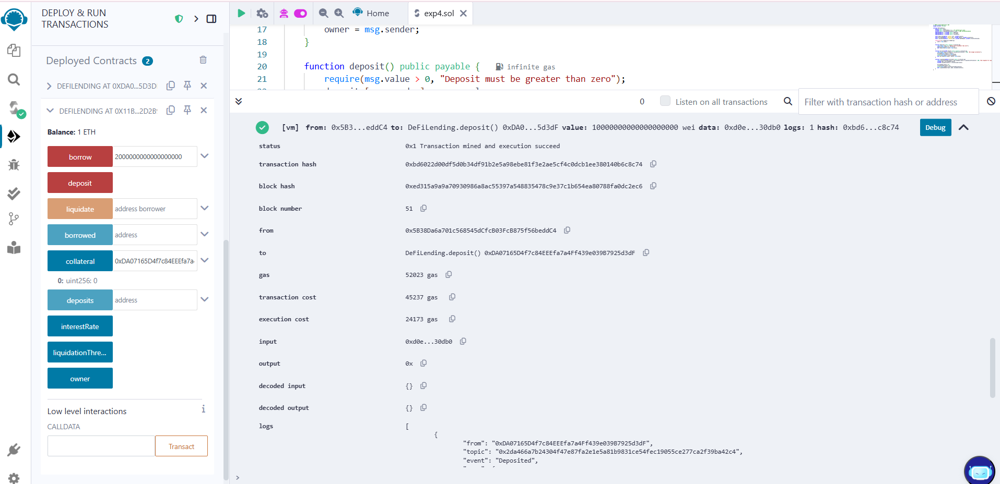
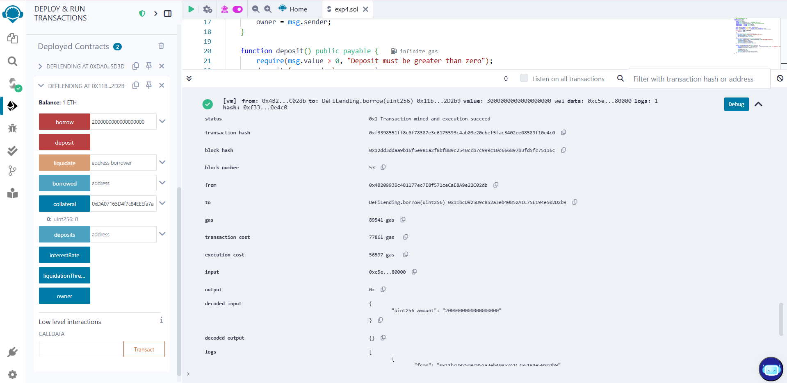
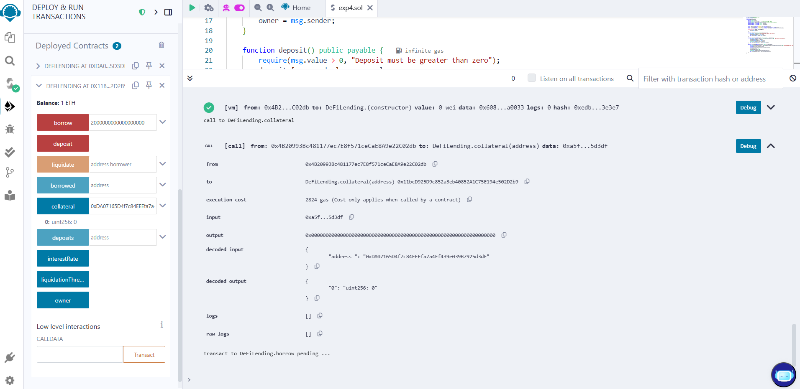

# Experiment 4: DeFi Lending and Borrowing Protocol

# NAME:MOHAMED AAKIF ASRAR S
# REGISTER NO:212223240088
# DATE : 21/04/2025

# Aim:
To build a decentralized lending protocol where users can deposit assets to earn interest and borrow assets by providing collateral. This experiment introduces concepts like overcollateralization, liquidity pools, and interest accrual in DeFi.

# Algorithm:
# Step 1:
 Users Provide ETH Liquidity to the Protocol
# Step 2:
 Depositors Earn Interest Based on Pool Utilization
# Step 3:
 Borrowers Take Loans by Locking Overcollateralized Assets
# Step 4:
 Borrowing Interest is Dynamically Adjusted by Utilization Rate
# Step 5:
 The Protocol Continuously Monitors Collateral Value via Oracles
# Step 6:
 Underwater Positions Can Be Liquidated by Third Parties


# Program:
```
// SPDX-License-Identifier: MIT
pragma solidity ^0.8.20;

contract DeFiLending {
    address public owner;
    uint256 public interestRate = 5; // 5% interest per cycle
    uint256 public liquidationThreshold = 150; // 150% collateralization
    mapping(address => uint256) public deposits;
    mapping(address => uint256) public borrowed;
    mapping(address => uint256) public collateral;

    event Deposited(address indexed user, uint256 amount);
    event Borrowed(address indexed user, uint256 amount, uint256 collateral);
    event Liquidated(address indexed user, uint256 debtRepaid, uint256 collateralSeized);

    constructor() {
        owner = msg.sender;
    }

    function deposit() public payable {
        require(msg.value > 0, "Deposit must be greater than zero");
        deposits[msg.sender] += msg.value;
        emit Deposited(msg.sender, msg.value);
    }

    function borrow(uint256 amount) public payable {
        require(msg.value >= (amount * liquidationThreshold) / 100, "Not enough collateral");
        borrowed[msg.sender] += amount;
        collateral[msg.sender] += msg.value;
        payable(msg.sender).transfer(amount);
        emit Borrowed(msg.sender, amount, msg.value);
    }

    function liquidate(address borrower) public {
        require(collateral[borrower] < (borrowed[borrower] * liquidationThreshold) / 100, "Not eligible for liquidation");
        uint256 debt = borrowed[borrower];
        uint256 seizedCollateral = collateral[borrower];

        borrowed[borrower] = 0;
        collateral[borrower] = 0;
        payable(msg.sender).transfer(seizedCollateral);
        emit Liquidated(borrower, debt, seizedCollateral);
    }
}

```
# Expected Output:
1. Users can deposit ETH and earn interest.

2. Users can borrow ETH by providing collateral.

3. If collateral < 150% of borrowed amount, liquidators can seize the collateral.


# High-Level Overview:
1. Teaches key DeFi concepts: lending, borrowing, collateral, liquidation.

2. Introduces risk management: overcollateralization and liquidation.

3. Directly related to DeFi protocols like Aave and Compound.

# OUTPUT:

# Deposit:

# Borrow:

# Collateral:


# RESULT : 
Thus , The decentralized lending protocol was successfully developed, enabling users to earn interest by depositing assets and to borrow against overcollateralized collateral, incorporating key DeFi mechanisms such as liquidity pools, dynamic interest rates, and automated liquidation.
